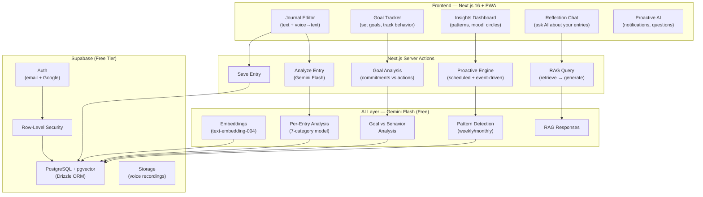
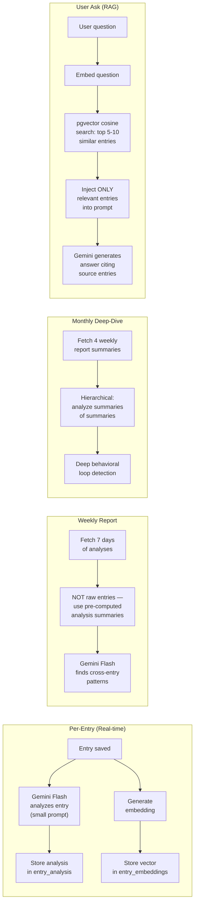

# mirror.ai — Personal Reflection Engine (Refined Plan v2)

> **Mission**: Help people find their blind spots, break behavioral loops, and grow — before mistakes become lifelong regrets.

> [!NOTE]
> All user feedback incorporated:
>
> - ✅ Drizzle ORM (no raw SQL)
> - ✅ PWA from Phase 1
> - ✅ Coss UI components only (use coss skills for particles)
> - ✅ Landing page excluded (user handles it)
> - ✅ Goal tracking feature added
> - ✅ Proactive AI (notifications, AI-initiated questions)
> - ✅ Flexible/extensible AI analysis model
> - ✅ Voice = voice→text (Web Speech API)
> - ✅ RAG with hierarchical summarization (no context window bloat)
> - ✅ Email + Google OAuth via Supabase
> - ✅ Vercel free subdomain for deployment

---

## Architecture Overview



---

## Tech Stack — $0/month

| Layer          | Technology                                   | Cost      |
| -------------- | -------------------------------------------- | --------- |
| **Framework**  | Next.js 16 (App Router)                      | Free      |
| **UI**         | coss / Base UI + Tailwind v4 (pre-installed) | Free      |
| **ORM**        | Drizzle ORM + drizzle-kit                    | Free      |
| **Database**   | Supabase PostgreSQL + pgvector               | Free tier |
| **Auth**       | Supabase Auth (email + Google OAuth)         | Free tier |
| **LLM**        | Gemini 3 Flash (free tier)                   | Free      |
| **Embeddings** | Gemini `text-embedding-004`                  | Free tier |
| **Voice**      | Web Speech API (browser-native)              | Free      |
| **Hosting**    | Vercel (free subdomain)                      | Free tier |
| **PWA**        | next-pwa / serwist                           | Free      |

---

## AI Behavioral Analysis Model (Extensible)

The AI doesn't just track mood. It captures **behavioral patterns** across 7 categories — designed to be extended as we discover more use cases:

| #   | Category                      | What It Captures                               | Example Detection                                            |
| --- | ----------------------------- | ---------------------------------------------- | ------------------------------------------------------------ |
| 1   | **Commitments vs Actions**    | Gap between intentions and execution           | "Planned 4 tasks, completed 0 — 3rd time this week"          |
| 2   | **Avoidance Patterns**        | What you avoid and what you substitute         | "Avoided job applications → scrolled social media"           |
| 3   | **Trigger → Reaction Chains** | Event → emotional/behavioral response mappings | "Criticism from boss → shutdown → didn't speak up"           |
| 4   | **Self-Deception Flags**      | Rationalizations, excuses, blame-shifting      | "'I'll do it tomorrow' — said 5 times about the same task"   |
| 5   | **Relationship Dynamics**     | Behavioral patterns with specific people       | "Always agrees with X even when disagreeing internally"      |
| 6   | **Decision Quality**          | Decisions made, reasoning, and outcomes        | "Chose comfort over growth — pattern detected 4x this month" |
| 7   | **Growth Signals**            | Self-awareness moments, changed behavior, wins | "Spoke up in meeting for the first time — progress!"         |

> [!TIP]
> This model is stored as a typed enum/config so we can add categories (e.g., "Financial Decisions", "Health Patterns", "Communication Style") without restructuring the database. Each category is a key in a JSONB column.

---

## RAG Strategy — No Context Window Bloat



**Key principle**: We never dump all entries into a prompt. Each level works with compact, pre-summarized data from the level below.

---

## Proposed Changes — Phased MVP

---

### Phase 1: Foundation — Auth + Journal + Goals + PWA (Week 1–2)

Core journaling and goal tracking. Users can sign up, write entries, set goals, and install as a mobile app.

---

#### Drizzle ORM Schema

##### [NEW] [lib/db/schema.ts](file:///home/stargazer/Desktop/Personal/Personal_reflection_engine/mirror.ai/lib/db/schema.ts)

Drizzle schema definitions for all tables:

```typescript
// Core tables defined with Drizzle ORM

// profiles — extends Supabase auth.users
//   id (uuid, PK, references auth.users)
//   displayName, avatarUrl, timezone
//   createdAt, updatedAt

// entries — journal entries
//   id (uuid, PK), userId (FK)
//   title, content (text), contentHtml (rich text)
//   entryType: 'journal' | 'goal_checkin' | 'reflection' | 'voice' | 'ai_response'
//   moodScore (1-10, optional)
//   parentEntryId (self-reference — for AI follow-up threads)
//   createdAt, updatedAt

// goals — user-defined goals
//   id (uuid, PK), userId (FK)
//   title, description
//   category: 'career' | 'health' | 'relationships' | 'learning' | 'habits' | 'custom'
//   status: 'active' | 'paused' | 'completed' | 'abandoned'
//   targetDate (optional)
//   createdAt, updatedAt

// goal_checkins — daily/periodic check-ins against goals
//   id (uuid, PK), goalId (FK), userId (FK), entryId (FK, optional)
//   planned (text — what they planned to do)
//   actual (text — what they actually did)
//   completionRate (0-100)
//   blockers (text — what got in the way)
//   createdAt

// entry_analysis — AI analysis per entry (7-category model)
//   id (uuid, PK), entryId (FK), userId (FK)
//   emotions (jsonb), themes (jsonb)
//   energyLevel: 'low' | 'medium' | 'high'
//   summary (text)
//   behavioralPatterns (jsonb) — the 7-category model as typed object:
//     { commitmentsVsActions, avoidancePatterns, triggerReactions,
//       selfDeceptionFlags, relationshipDynamics, decisionQuality, growthSignals }
//   aiQuestions (jsonb) — follow-up questions for the user
//   rawAnalysis (jsonb) — full AI response
//   createdAt

// entry_embeddings — vector embeddings for RAG
//   id (uuid, PK), entryId (FK), userId (FK)
//   embedding (vector 768-dim)
//   createdAt

// pattern_reports — weekly/monthly AI analysis
//   id (uuid, PK), userId (FK)
//   reportType: 'weekly' | 'monthly'
//   periodStart (date), periodEnd (date)
//   patterns (jsonb) — detected behavioral loops
//   recommendations (jsonb) — suggested actions
//   goalProgress (jsonb) — how goals are tracking
//   circlesDetected (jsonb) — the "circles you're stuck in"
//   entriesAnalyzed (integer)
//   createdAt

// ai_nudges — proactive AI-initiated questions/notifications
//   id (uuid, PK), userId (FK)
//   nudgeType: 'question' | 'insight' | 'pattern_alert' | 'goal_reminder' | 'encouragement'
//   content (text) — the question or insight
//   sourceEntryIds (jsonb) — entries that triggered this nudge
//   status: 'pending' | 'seen' | 'responded' | 'dismissed'
//   userResponse (text, optional)
//   createdAt, seenAt, respondedAt
```

##### [NEW] [lib/db/index.ts](file:///home/stargazer/Desktop/Personal/Personal_reflection_engine/mirror.ai/lib/db/index.ts)

Drizzle client initialized with Supabase Postgres connection via `postgres` driver.

##### [NEW] [drizzle.config.ts](file:///home/stargazer/Desktop/Personal/Personal_reflection_engine/mirror.ai/drizzle.config.ts)

Drizzle Kit config for migrations — points to Supabase database URL.

---

#### Supabase Integration

##### [NEW] [lib/supabase/server.ts](file:///home/stargazer/Desktop/Personal/Personal_reflection_engine/mirror.ai/lib/supabase/server.ts)

Server-side Supabase client using `@supabase/ssr` — for auth session management in Server Components and Server Actions. Uses cookie-based sessions compatible with Next.js 16 async `cookies()`.

##### [NEW] [lib/supabase/client.ts](file:///home/stargazer/Desktop/Personal/Personal_reflection_engine/mirror.ai/lib/supabase/client.ts)

Browser-side Supabase client using `@supabase/ssr` — for client-side auth state, realtime subscriptions.

##### [NEW] [lib/supabase/types.ts](file:///home/stargazer/Desktop/Personal/Personal_reflection_engine/mirror.ai/lib/supabase/types.ts)

Supabase-generated TypeScript types (auto-generated via `supabase gen types`).

---

#### Auth Flow

##### [NEW] [proxy.ts](file:///home/stargazer/Desktop/Personal/Personal_reflection_engine/mirror.ai/proxy.ts)

Next.js 16 proxy (replaces middleware.ts):

- Refreshes Supabase auth session on every request
- Protects `/(app)/*` routes — redirects unauthenticated users to `/login`
- Allows public routes: `/`, `/login`, `/signup`, `/privacy`

##### [NEW] [app/(auth)/login/page.tsx](<file:///home/stargazer/Desktop/Personal/Personal_reflection_engine/mirror.ai/app/(auth)/login/page.tsx>)

Login page using **coss components** (Card, Input, Button, Field, Label, Separator):

- Email + password form
- Google OAuth button
- Link to signup
- Error display via coss Toast

##### [NEW] [app/(auth)/signup/page.tsx](<file:///home/stargazer/Desktop/Personal/Personal_reflection_engine/mirror.ai/app/(auth)/signup/page.tsx>)

Registration page using **coss components**:

- Email + password + display name
- Google OAuth button
- Link to login

##### [NEW] [app/(auth)/callback/route.ts](<file:///home/stargazer/Desktop/Personal/Personal_reflection_engine/mirror.ai/app/(auth)/callback/route.ts>)

OAuth callback route handler — exchanges auth code for session, redirects to `/journal`.

##### [NEW] [lib/actions/auth.ts](file:///home/stargazer/Desktop/Personal/Personal_reflection_engine/mirror.ai/lib/actions/auth.ts)

Server Actions:

- `signUp(formData)` — creates account, creates profile row
- `signIn(formData)` — email/password login
- `signInWithGoogle()` — initiates OAuth flow
- `signOut()` — clears session, redirects to `/`

---

#### App Shell

##### [NEW] [app/(app)/layout.tsx](<file:///home/stargazer/Desktop/Personal/Personal_reflection_engine/mirror.ai/app/(app)/layout.tsx>)

Authenticated app layout using **coss Sidebar** component:

- Sidebar navigation: Journal, Goals, Insights, Reflect, Settings
- Mobile-responsive (sheet fallback via coss Drawer/Sheet)
- User avatar + name in footer (from Supabase auth)
- Theme toggle (already working via ThemeProvider)
- Collapsible sidebar (Cmd+B shortcut already built into coss Sidebar)

##### [MODIFY] [app/layout.tsx](file:///home/stargazer/Desktop/Personal/Personal_reflection_engine/mirror.ai/app/layout.tsx)

- Add PWA manifest link
- Add meta tags for PWA (theme-color, apple-mobile-web-app-capable)
- Keep existing ThemeProvider

---

#### Journal CRUD

##### [NEW] [app/(app)/journal/page.tsx](<file:///home/stargazer/Desktop/Personal/Personal_reflection_engine/mirror.ai/app/(app)/journal/page.tsx>)

Journal timeline — chronological list of entries:

- Entry cards using coss Card component (title, preview, date, emotion tags as coss Badge)
- Floating action button to create new entry
- Empty state for new users using coss Empty component
- Date-based grouping ("Today", "Yesterday", "This Week", etc.)

##### [NEW] [app/(app)/journal/new/page.tsx](<file:///home/stargazer/Desktop/Personal/Personal_reflection_engine/mirror.ai/app/(app)/journal/new/page.tsx>)

Journal entry editor:

- Clean textarea (coss Textarea) — distraction-free writing
- Optional mood selector (coss Slider or custom 1-10 emoji scale)
- Voice input toggle button (Phase 3 — placeholder for now)
- Auto-save with debounce (saves draft to localStorage)
- On submit: Server Action → save entry → trigger AI analysis async

##### [NEW] [app/(app)/journal/[id]/page.tsx](<file:///home/stargazer/Desktop/Personal/Personal_reflection_engine/mirror.ai/app/(app)/journal/[id]/page.tsx>)

Single entry view:

- Full entry content
- AI analysis panel (emotions, themes, behavioral patterns) — shown after AI processes
- AI follow-up questions (user can respond → creates linked entry)
- Edit/delete actions

##### [NEW] [lib/actions/entries.ts](file:///home/stargazer/Desktop/Personal/Personal_reflection_engine/mirror.ai/lib/actions/entries.ts)

Server Actions:

- `createEntry(formData)` — validate, store via Drizzle, return entry ID
- `updateEntry(id, formData)` — update entry
- `deleteEntry(id)` — cascading delete
- `getEntries(userId, filters)` — paginated, filterable query
- `getEntry(id)` — single entry with analysis

---

#### Goal Tracking

##### [NEW] [app/(app)/goals/page.tsx](<file:///home/stargazer/Desktop/Personal/Personal_reflection_engine/mirror.ai/app/(app)/goals/page.tsx>)

Goals dashboard:

- Active goals displayed as coss Cards with progress indicators (coss Progress/Meter)
- "Add Goal" button → dialog/sheet for goal creation
- Each goal shows: title, category badge, target date, recent check-in status
- Completion rate visualization
- Paused/completed/abandoned goals in collapsible section (coss Accordion)

##### [NEW] [app/(app)/goals/[id]/page.tsx](<file:///home/stargazer/Desktop/Personal/Personal_reflection_engine/mirror.ai/app/(app)/goals/[id]/page.tsx>)

Single goal detail view:

- Goal description and metadata
- Check-in history timeline (what was planned vs what happened)
- AI-detected patterns for this specific goal ("You tend to skip this goal on Mondays")
- Quick check-in form: "What did you plan?" → "What did you do?" → "What got in the way?"

##### [NEW] [lib/actions/goals.ts](file:///home/stargazer/Desktop/Personal/Personal_reflection_engine/mirror.ai/lib/actions/goals.ts)

Server Actions:

- `createGoal(formData)` — create goal with category and optional target date
- `updateGoal(id, formData)` — update goal details/status
- `deleteGoal(id)` — delete goal and check-ins
- `checkIn(goalId, formData)` — record planned vs actual, link to journal entry
- `getGoals(userId)` — list goals with latest check-in
- `getGoalWithCheckins(goalId)` — goal + full check-in history

---

#### PWA Setup

##### [NEW] [public/manifest.json](file:///home/stargazer/Desktop/Personal/Personal_reflection_engine/mirror.ai/public/manifest.json)

PWA manifest:

- `name`: "mirror.ai"
- `short_name`: "mirror"
- `start_url`: "/journal"
- `display`: "standalone"
- `theme_color`: matches dark theme
- `background_color`: matches app background
- Icons (we'll generate these)

##### PWA Configuration

- Install `serwist` (modern successor to next-pwa) for service worker generation
- Configure offline caching for app shell
- Add install prompt component

---

### Phase 2: AI Integration — Analysis + Embeddings (Week 3–4)

Every entry gets analyzed. Embeddings enable semantic search. AI starts finding patterns.

---

#### AI Service Layer

##### [NEW] [lib/ai/gemini.ts](file:///home/stargazer/Desktop/Personal/Personal_reflection_engine/mirror.ai/lib/ai/gemini.ts)

Gemini API client:

- `analyzeEntry(content, recentAnalyses?)` — 7-category behavioral analysis
- `generateEmbedding(content)` — 768-dim vector
- `generateWeeklyReport(analyses[], goalCheckins[])` — pattern detection from pre-computed summaries (NOT raw entries)
- `generateMonthlyReport(weeklyReports[])` — hierarchical: analyze summaries of summaries
- `ragQuery(question, relevantEntries[])` — answer questions with cited sources
- `generateNudge(recentAnalyses[], goals[])` — proactive question/insight generation
- Rate limiting, retry with exponential backoff, error handling

##### [NEW] [lib/ai/prompts.ts](file:///home/stargazer/Desktop/Personal/Personal_reflection_engine/mirror.ai/lib/ai/prompts.ts)

Prompt templates — centralized, versioned, extensible:

**Per-Entry Analysis System Prompt** (7-category model):

```
You are a compassionate, perceptive reflection assistant. Analyze this journal
entry across these behavioral dimensions. Be warm but honest. Never diagnose.
Observe and ask.

Return structured JSON matching this schema:
{
  "emotions": ["1-3 primary emotions"],
  "emotionalNuance": "one sentence capturing complexity",
  "themes": ["life themes: work, relationships, health, growth..."],
  "energyLevel": "low | medium | high",
  "summary": "one-sentence summary",
  "behavioralPatterns": {
    "commitmentsVsActions": "gap between what was planned and done, or null",
    "avoidancePatterns": "what's being avoided and substituted, or null",
    "triggerReactions": "event → emotional/behavioral response, or null",
    "selfDeceptionFlags": "rationalizations or excuses detected, or null",
    "relationshipDynamics": "patterns with specific people, or null",
    "decisionQuality": "decisions made and reasoning quality, or null",
    "growthSignals": "self-awareness or positive change moments, or null"
  },
  "followUpQuestions": ["1-2 gentle questions to deepen reflection"]
}

If previous analysis context is provided, look for CROSS-ENTRY PATTERNS —
especially repeating behaviors the person may not notice.
Set any behavioral pattern category to null if not relevant to this entry.
```

**Goal Check-In Analysis Prompt** (compares planned vs actual):

```
The user set a goal: {goal.title}
They planned: {checkin.planned}
They actually did: {checkin.actual}
Blockers: {checkin.blockers}

Previous check-ins for this goal: {history}

Analyze: Is there a pattern in what blocks them? Are the blockers
consistent (same excuse repeated)? Is there progress despite setbacks?
```

##### [NEW] [lib/ai/analysis-categories.ts](file:///home/stargazer/Desktop/Personal/Personal_reflection_engine/mirror.ai/lib/ai/analysis-categories.ts)

Typed enum/config for the 7 behavioral categories — extensible:

```typescript
// Each category has: id, label, description, promptHint
// New categories can be added here without schema changes
// (stored in JSONB, so new keys are automatically supported)
export const ANALYSIS_CATEGORIES = { ... } as const
```

##### [NEW] [lib/ai/embeddings.ts](file:///home/stargazer/Desktop/Personal/Personal_reflection_engine/mirror.ai/lib/ai/embeddings.ts)

Embedding pipeline:

- `embedAndStore(entryId, content, userId)` — generate → store in Drizzle
- `searchSimilar(query, userId, limit)` — pgvector cosine search, returns top-K entries
- `getContextForRAG(query, userId)` — retrieve + format relevant entries for prompt injection

##### [NEW] [lib/actions/analysis.ts](file:///home/stargazer/Desktop/Personal/Personal_reflection_engine/mirror.ai/lib/actions/analysis.ts)

Server Actions (called after entry save):

- `analyzeEntry(entryId)` — fetch entry, run Gemini analysis + embedding in parallel, store results
- `regenerateAnalysis(entryId)` — re-run for edited entries
- `getAnalysis(entryId)` — fetch existing analysis

---

#### Insights Dashboard

##### [NEW] [app/(app)/insights/page.tsx](<file:///home/stargazer/Desktop/Personal/Personal_reflection_engine/mirror.ai/app/(app)/insights/page.tsx>)

Pattern visualization dashboard:

- **Mood Timeline**: Line chart (last 30 days) — build with SVG or lightweight chart lib
- **Emotion Frequency**: Most common emotions as coss Badge frequency chart
- **"Your Circles"**: The headline feature — visual cards showing detected behavioral loops with evidence (links to source entries), e.g. "You've said 'I'll start tomorrow' 7 times in 3 weeks"
- **Theme Cloud**: Recurring life themes sized by frequency
- **Latest Weekly Report**: Card with key insights, expandable
- **Goal Progress Overview**: How goals are tracking vs check-ins

##### [NEW] [app/(app)/insights/reports/[id]/page.tsx](<file:///home/stargazer/Desktop/Personal/Personal_reflection_engine/mirror.ai/app/(app)/insights/reports/[id]/page.tsx>)

Full pattern report view:

- Detailed weekly/monthly analysis
- Linked source entries for each detected pattern
- Recommendations
- Goal progress section

---

#### Proactive AI System

##### [NEW] [lib/ai/proactive.ts](file:///home/stargazer/Desktop/Personal/Personal_reflection_engine/mirror.ai/lib/ai/proactive.ts)

Engine that generates AI-initiated nudges:

- **After entry analysis**: If a pattern is detected (e.g., same avoidance behavior 3+ times), create a nudge
- **Goal check-in reminders**: If user hasn't checked in on an active goal in 2+ days
- **Pattern alerts**: When a new behavioral loop is detected across multiple entries
- **Encouragement**: When growth signals are detected, celebrate wins
- Stores nudges in `ai_nudges` table with status tracking

##### Nudge Display

- Shown as a notification badge in the app shell sidebar
- Nudge panel/popover in the header
- On the journal page as inline cards between entries
- Designed to be non-intrusive — user can dismiss or respond

---

### Phase 3: Voice Input + RAG Chat (Week 5–6)

Voice journaling and conversational reflection.

---

#### Voice-to-Text Input

##### [NEW] [hooks/use-speech-recognition.ts](file:///home/stargazer/Desktop/Personal/Personal_reflection_engine/mirror.ai/hooks/use-speech-recognition.ts)

Custom React hook wrapping Web Speech API:

- `startListening()` / `stopListening()`
- `isListening` / `transcript` / `interimTranscript` state
- `isSupported` — browser compatibility check
- Real-time interim results shown as user speaks
- Final transcript returned as plain text
- Graceful fallback message for unsupported browsers

##### [MODIFY] Journal Editor (`app/(app)/journal/new/page.tsx`)

- Add microphone toggle button (coss Toggle or Button with mic icon)
- When listening: pulsing indicator, real-time text appearing
- Transcribed text appended to textarea content
- User can edit transcription before saving

---

#### RAG Reflection Chat

##### [NEW] [app/(app)/reflect/page.tsx](<file:///home/stargazer/Desktop/Personal/Personal_reflection_engine/mirror.ai/app/(app)/reflect/page.tsx>)

Chat interface for self-reflection:

- Message-style UI (user messages + AI responses)
- Suggested starter prompts: "Why do I keep procrastinating?", "What patterns do you see in my relationships?", "What am I avoiding?"
- AI responses include **cited source entries** (clickable links to journal entries)
- Streaming responses via Server-Sent Events or React Server Components streaming
- Conversation history within session

##### [NEW] [lib/actions/reflect.ts](file:///home/stargazer/Desktop/Personal/Personal_reflection_engine/mirror.ai/lib/actions/reflect.ts)

RAG Server Action pipeline:

1. User sends question
2. Generate embedding for the question
3. pgvector cosine search → top 5-10 similar entries (user's own only, RLS enforced)
4. Construct prompt: question + retrieved entries as context
5. Stream Gemini response
6. Parse and return source entry references

---

#### Scheduled Analysis (Weekly/Monthly Reports)

##### [NEW] [app/api/cron/weekly-report/route.ts](file:///home/stargazer/Desktop/Personal/Personal_reflection_engine/mirror.ai/app/api/cron/weekly-report/route.ts)

Vercel Cron endpoint (runs every Sunday):

1. Fetch all users with entries in the past 7 days
2. For each user: fetch their **entry_analysis summaries** (NOT raw entries — avoids context bloat)
3. Also fetch goal check-ins for the period
4. Run Gemini pattern detection on the compact summaries
5. Store as `pattern_report`
6. Generate proactive nudges based on findings

##### [NEW] [app/api/cron/monthly-report/route.ts](file:///home/stargazer/Desktop/Personal/Personal_reflection_engine/mirror.ai/app/api/cron/monthly-report/route.ts)

Vercel Cron endpoint (runs 1st of each month):

1. Fetch the 4 weekly reports from the past month
2. **Hierarchical analysis**: analyze the weekly summaries (not raw entries)
3. Detect month-level behavioral loops
4. Compare goal progress over the month
5. Store as monthly `pattern_report`

---

### Phase 4: Polish + Privacy + Deployment (Week 7–8)

Production readiness.

---

#### Settings & Privacy

##### [NEW] [app/(app)/settings/page.tsx](<file:///home/stargazer/Desktop/Personal/Personal_reflection_engine/mirror.ai/app/(app)/settings/page.tsx>)

User settings using coss components:

- Profile: display name, avatar (via Supabase Storage), timezone (coss Select)
- Privacy controls:
  - Toggle AI analysis on/off (coss Switch)
  - Data export button → downloads ZIP of all data as JSON
  - Account deletion with confirmation dialog (coss AlertDialog)
- Notification preferences for AI nudges

##### [NEW] [app/privacy/page.tsx](file:///home/stargazer/Desktop/Personal/Personal_reflection_engine/mirror.ai/app/privacy/page.tsx)

Privacy policy page — disclosure about:

- What data is collected
- How Gemini processes entries (free tier data usage caveat)
- Supabase storage (encrypted at rest)
- User rights (export, delete)

##### [NEW] [lib/actions/privacy.ts](file:///home/stargazer/Desktop/Personal/Personal_reflection_engine/mirror.ai/lib/actions/privacy.ts)

- `exportUserData(userId)` — generates JSON of all entries, analyses, goals, reports
- `deleteUserAccount(userId)` — cascading deletion, clears Supabase auth account
- `toggleAIAnalysis(userId, enabled)` — opt in/out

---

#### Deployment

##### [NEW] [.env.local.example](file:///home/stargazer/Desktop/Personal/Personal_reflection_engine/mirror.ai/.env.local.example)

```
NEXT_PUBLIC_SUPABASE_URL=
NEXT_PUBLIC_SUPABASE_ANON_KEY=
SUPABASE_SERVICE_ROLE_KEY=
SUPABASE_DB_URL=
GEMINI_API_KEY=
CRON_SECRET=
```

##### [NEW] [vercel.json](file:///home/stargazer/Desktop/Personal/Personal_reflection_engine/mirror.ai/vercel.json)

Vercel config with cron schedules:

```json
{
  "crons": [
    { "path": "/api/cron/weekly-report", "schedule": "0 0 * * 0" },
    { "path": "/api/cron/monthly-report", "schedule": "0 0 1 * *" }
  ]
}
```

##### [MODIFY] [next.config.ts](file:///home/stargazer/Desktop/Personal/Personal_reflection_engine/mirror.ai/next.config.ts)

- PWA configuration (serwist integration)
- Image remote patterns for Supabase Storage URLs

---

## App Route Map (Final)

```
app/
├── layout.tsx                     (root — fonts, PWA meta, ThemeProvider)
├── page.tsx                       (landing — USER handles this)
├── privacy/page.tsx               (privacy policy)
│
├── (auth)/
│   ├── login/page.tsx
│   ├── signup/page.tsx
│   └── callback/route.ts
│
├── (app)/
│   ├── layout.tsx                 (sidebar shell — auth-gated)
│   ├── journal/
│   │   ├── page.tsx               (timeline)
│   │   ├── new/page.tsx           (editor + voice)
│   │   └── [id]/page.tsx          (view/edit + AI panel)
│   ├── goals/
│   │   ├── page.tsx               (goals dashboard)
│   │   └── [id]/page.tsx          (goal detail + check-ins)
│   ├── insights/
│   │   ├── page.tsx               (patterns dashboard)
│   │   └── reports/[id]/page.tsx  (full report view)
│   ├── reflect/
│   │   └── page.tsx               (RAG chat)
│   └── settings/
│       └── page.tsx               (profile + privacy controls)
│
├── api/
│   └── cron/
│       ├── weekly-report/route.ts
│       └── monthly-report/route.ts
│
└── proxy.ts                       (auth protection)
```

---

## New Dependencies to Install

```bash
# Database
bun add drizzle-orm postgres
bun add -d drizzle-kit

# Supabase
bun add @supabase/supabase-js @supabase/ssr

# AI
bun add @google/generative-ai

# PWA
bun add serwist @serwist/next
```

---

## Verification Plan

### Automated

- `bun run typecheck` — zero TypeScript errors
- `bun run build` — production build succeeds
- Drizzle migrations apply cleanly to Supabase

### Manual Testing

- **Auth flow**: signup → login → logout → OAuth → session persistence
- **Journal CRUD**: create → view → edit → delete → list with pagination
- **Goal tracking**: create goal → check in → view history → see patterns
- **AI analysis**: write entry → see analysis appear → check all 7 categories
- **RAG chat**: ask question → get response with cited entries
- **Voice input**: tap mic → speak → see transcription → edit → save
- **PWA**: "Add to Home Screen" on mobile → offline app shell loads
- **Privacy**: export data → verify complete → delete account → verify clean
- **Dark mode**: all pages render correctly in both themes
- **Mobile responsive**: all pages work on mobile viewport
- **RLS**: verify users cannot access other users' data (test with two accounts)
